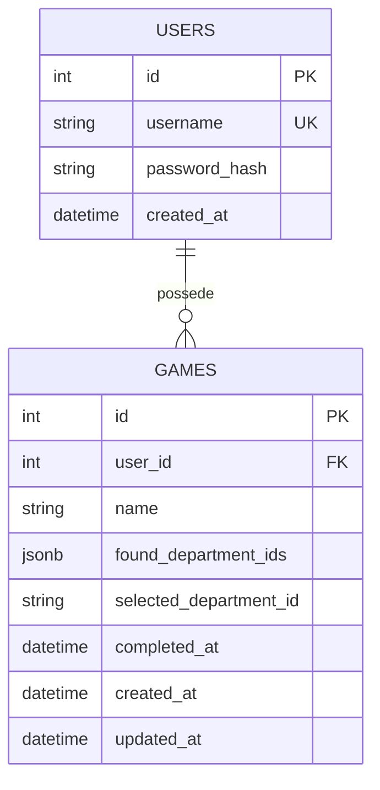

# Memory Game

Web game where you have to guess french departments from a map.

## Stack

- Frontend : Javascript/HTML/CSS
- Backend : Flask
- Database : PostgreSQL
- ORM : SQLAlchemy
- Migrations : Alembic

## Database graph

