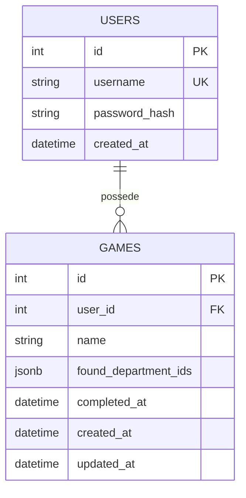

# Department Guesser

Web game where you have to guess french departments from a map.
You can create an account to save your games and log back in at a later time, or you can play without saving your progression.

## Stack

- Frontend : Javascript/HTML/CSS
- Backend : Flask
- Database : PostgreSQL
- ORM : SQLAlchemy
- Migrations : Alembic

## Database graph

