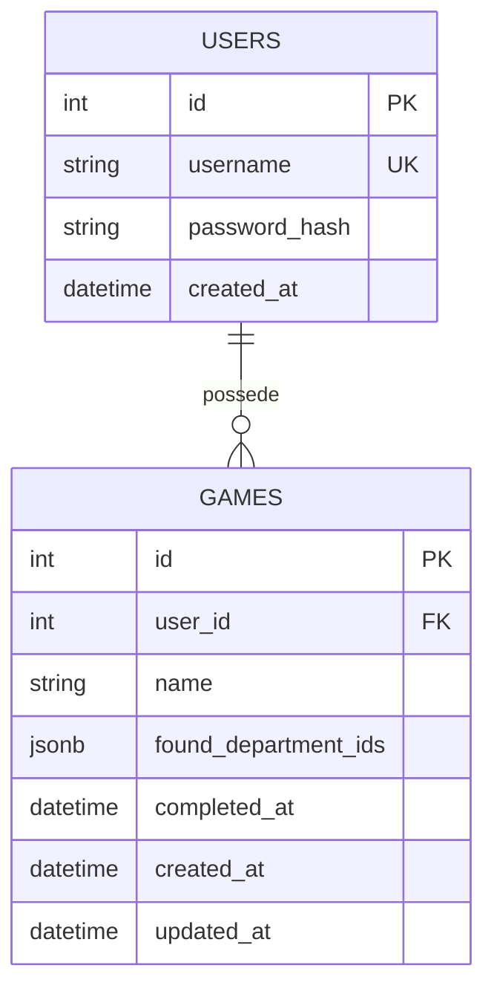

# Department Guesser

Web game where you have to guess french departments from a map.
You can create an account to save your games and log back in at a later time, or you can play without saving your progression.

## Stack

- Frontend : Javascript/HTML/CSS
- Backend : Flask
- Database : PostgreSQL
- ORM : SQLAlchemy
- Migrations : Alembic

## Backend setup

From the `backend` directory:

```bash
uv sync
cp .env.example .env
uv run flask --app run run --debug
```

`uv sync` creates the `.venv` virtual environment and installs the exact
dependency versions recorded in `uv.lock`. The project metadata and direct
dependencies are declared in `backend/pyproject.toml`.

To add or remove a dependency:

```bash
uv add package-name
uv remove package-name
```

## Database graph


```mermaid
erDiagram
    USERS ||--o{ GAMES : "possede"

    USERS {
        int id PK
        string username UK
        string password_hash
        datetime created_at
    }

    GAMES {
        int id PK
        int user_id FK
        string name
        jsonb found_department_ids
        datetime completed_at
        datetime created_at
        datetime updated_at
    }
```
