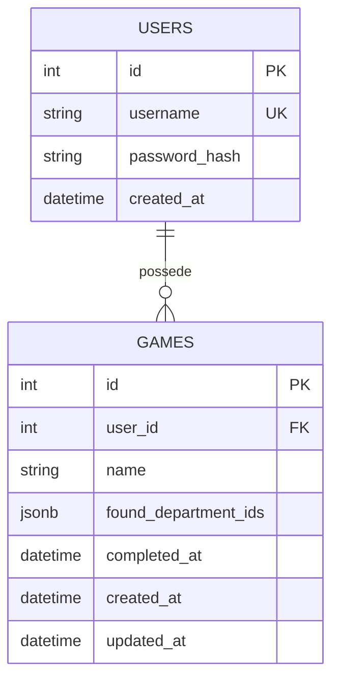

# Department Guesser

Web game where you have to guess french departments from a map.
You can create an account to save your games and log back in at a later time, or you can play without saving your progression.


## Stack

- Frontend : Javascript/HTML/CSS
- Backend : Flask
- Database : PostgreSQL
- ORM : SQLAlchemy
- Migrations : Alembic
- Production server : Gunicorn
- Reverse proxy : Nginx

## Run with Docker

Requirements: Docker and Docker Compose.

From the project root:

```bash
cp .env.example .env
docker compose up --build
```

If Docker is installed with the standalone Compose executable, use
`docker-compose` instead of `docker compose` in these commands.

Open `http://localhost:8080`. The port can be changed with `APP_PORT` in
the root `.env` file.

The stack contains four Compose services running three long-lived containers:

- `frontend`: Nginx serves the static frontend and proxies `/api` requests;
- `backend`: Gunicorn runs the Flask application;
- `database`: PostgreSQL stores the application data;
- `migrate`: a one-shot service applies the Alembic migrations before the API starts.

Stop the application while preserving database data:

```bash
docker compose down
```

To also delete the PostgreSQL volume and all application data:

```bash
docker compose down --volumes
```

Do not commit the root `.env` file. Replace the example passwords and secrets
before exposing the application outside your machine.

## Local development without Docker

From the `backend` directory:

```bash
uv sync
cp .env.example .env
uv run flask --app run run --debug
```

## Backend integration tests

The integration tests use a dedicated PostgreSQL container. From the project
root, start it with:

```bash
docker compose --profile test up -d database-test
```

If Compose is installed as a standalone executable, replace `docker compose`
with `docker-compose`.

Then run the test suite from the `backend` directory:

```bash
uv sync --dev
uv run pytest
```

Unit tests do not require PostgreSQL and can be run independently:

```bash
uv run pytest tests/unit
```

Run only the integration tests, after starting `database-test`:

```bash
uv run pytest tests/integration
```

Generate a coverage report with:

```bash
uv run pytest --cov=app --cov-report=term-missing
```

The test database listens only on `127.0.0.1:5433`, uses temporary storage,
and is separate from the development database. Stop it from the project root:

```bash
docker compose --profile test down
```

## Database graph


```mermaid
erDiagram
    USERS ||--o{ GAMES : "possede"

    USERS {
        int id PK
        string username UK
        string password_hash
        datetime created_at
    }

    GAMES {
        int id PK
        int user_id FK
        string name
        jsonb found_department_ids
        datetime completed_at
        datetime created_at
        datetime updated_at
    }
```
